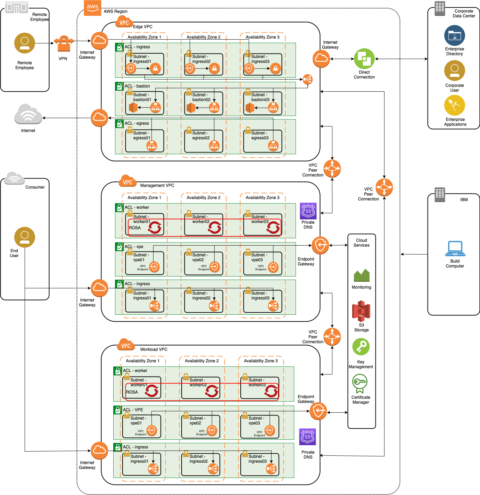

# FSCloud-on-AWS
 This repository is to document the build of a Finacial Services Cloud equivalent on native AWS.

 The environment is built using AWS components Ansible automation.

 ## DRAFT
 It is currently a work in progress.

 Currently working on the network elements to determine how to emulate the FS Cloud security features in AWS, including Network ACLs, Security Groups, multiple VPCs, routing tables, internet gateways, VPN endpoints and so forth.

 The [inventory.yaml](inventory.yaml) file represents the components and example variables of the required cloud environment. My own notes on what parameters were needed for each component. This will be migrated into the variables.json file.

 The [variables.json](variables.json) file represents the variables of a particular build as input to automation and a more formal way of capturing the parameters. Read by Ansible.

 The [build-steps](build-steps.md) readme contains the manual steps using the AWS CLI to create the cloud environment. Will be migrated to Ansible for automation.

 The [Access Guide](access-options.md) provides options tested for users to access provisioned servers in the AWS environment.

 The [Red Hat OpenShift on AWS (ROSA)](ROSA-cluster.md) documents the steps to build the OpenShift clusters. 

 The [AWS-CLI-cmds readme](AWS-CLI-cmds.md) document contains the key AWS CLI commands that would be utilized for a build. These could be included in an Ansible playbook. Per above, investigating if it is easier to use Ansible command line calls to aws cli or aws modules.

 The architectural overview of the environment is as follows:

## References

Install AWS CLI [https://aws.amazon.com/cli/](https://aws.amazon.com/cli/)

AWS CLI reference [https://awscli.amazonaws.com/v2/documentation/api/latest/reference/ec2/index.html](https://awscli.amazonaws.com/v2/documentation/api/latest/reference/ec2/index.html)

A subset of the CLI reference is documented in this repository [here](AWS-CLI-cmds.md) for the relevant commands and syntax to build the cloud.

Ansible CLI module reference (amazon.aws) [https://docs.ansible.com/ansible/latest/collections/amazon/aws/index.html](https://docs.ansible.com/ansible/latest/collections/amazon/aws/index.html)
