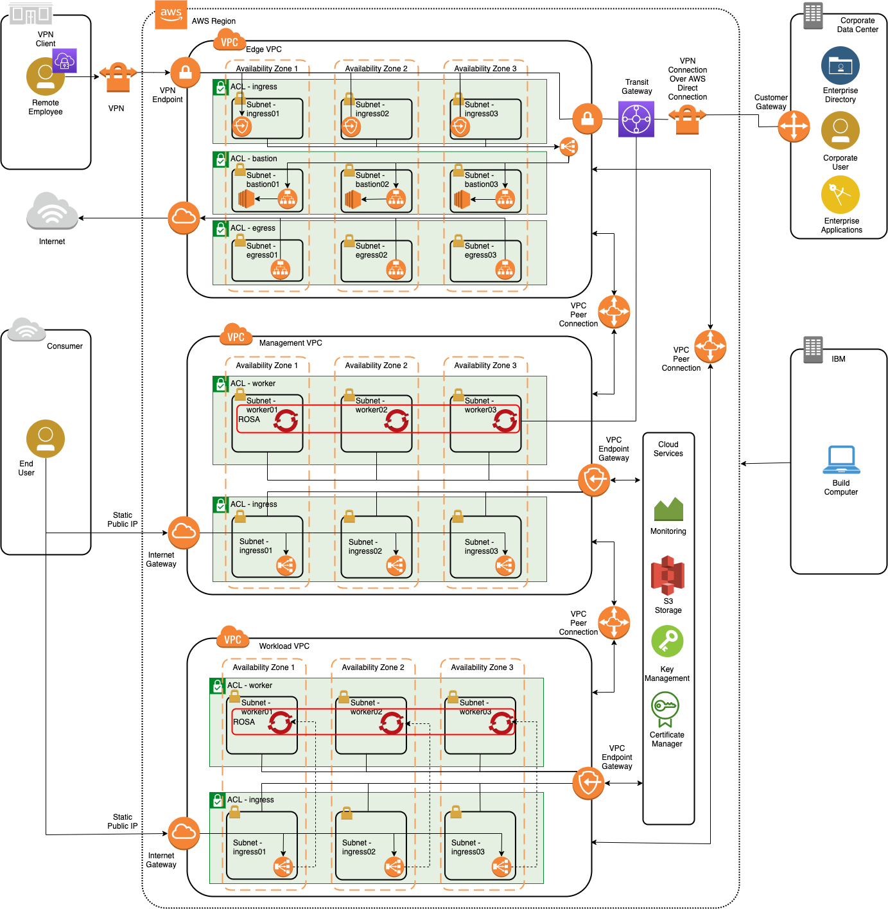
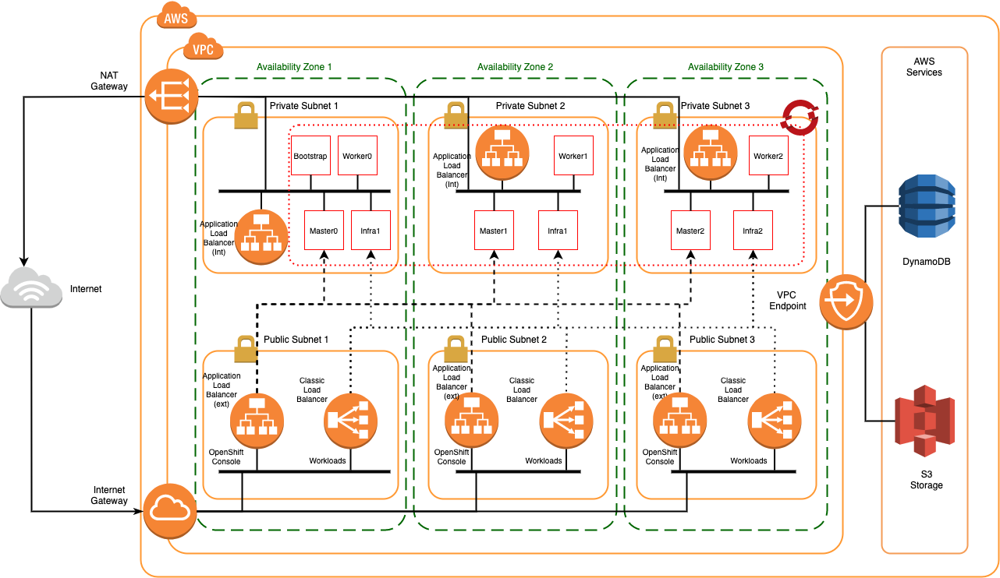

# IBM AWS Reference Architecture
 This repository is to document the build of a cloud reference architecture on AWS that support OpenShift ROSA with automation from Red Hat Ansible.

 The environment is built using AWS components with Ansible automation (see the [Red Hat Ansible collection repository](https://console.redhat.com/ansible/automation-hub))

 ## Instructions

 1. Clone this repository

      ```
      $ git clone https://github.com/cloud-native-toolkit/ibm-aws-reference-arch-ansible
      ```

1. If this is the first time running ansible to automate AWS on your local laptop/system, complete the following.

   1. Install the AWS CLI by following the guide [here](https://docs.aws.amazon.com/cli/latest/userguide/cli-chap-welcome.html)
   1. Install Ansible by following the guide [here](https://docs.ansible.com/ansible/latest/installation_guide/intro_installation.html)
   1. Configure AWS CLI to output JSON format (the output field in the file ~/.aws/config on Mac/Linux)
   1. Install the rosa command line tool
   1. Create the ROSA account roles per the instructions [here](https://www.rosaworkshop.io/rosa/2-deploy/#create-account-roles)

1. Change to ansible sub-directory under the cloned repository

      ```
      $ cd ./ansible/
      ```
1. Edit the variables file to customize the installation
      ```
      $ vi ./group_vars/all
      ```
1. Review the initial inventory file for what is to be created. 

      ```
      $ vi ./inventory.yaml
      ```

1. Run the ansible playbook

      ```
      $ ansible-playbook ./create.yaml
      ```

 ## DRAFT
 It is currently a work in progress.

 ## Reference Architecture

 [Architectural Decisions](ADs.md) document the design decisions made and the rationale for each decision.

 [RAID Log](RAID_Log.md) documents the risks, issues, assumptions and dependencies in the design.

 The architectural overview of the environment is as follows:



 The [networking](networking.md) readme contains details of the network configuration for this setup.

Further details of the Management and Workload VPCs are per the following architecture overview and in the ROSA details [here](./ROSA-cluster.md#Multiple_AZ_cluster_configuration):



 ## Background Details

 The [Access Guide](access-options.md) provides options tested for users to access provisioned servers in the AWS environment.

 The [Red Hat OpenShift on AWS (ROSA)](ROSA-cluster.md) documents the steps to build the OpenShift clusters and shows the generated architecture. 

## External References

Ansible collection repository [https://console.redhat.com/ansible/automation-hub](https://console.redhat.com/ansible/automation-hub)

Install AWS CLI [https://aws.amazon.com/cli/](https://aws.amazon.com/cli/)

AWS CLI reference [https://awscli.amazonaws.com/v2/documentation/api/latest/reference/ec2/index.html](https://awscli.amazonaws.com/v2/documentation/api/latest/reference/ec2/index.html)

Ansible module reference (amazon.aws) [https://docs.ansible.com/ansible/latest/collections/amazon/aws/index.html](https://docs.ansible.com/ansible/latest/collections/amazon/aws/index.html)
