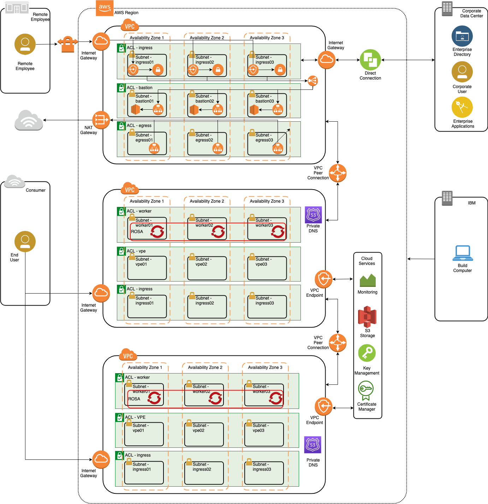

# FSCloud-on-AWS
 This repository is to document the build of a Finacial Services Cloud equivalent on native AWS.

 The environment is built using AWS components Ansible automation.

 ## DRAFT
 It is currently a work in progress.

 The [inventory.yaml](inventory.yaml) file represents the components and example variables of the required cloud environment.

 The [variables.json](variables.json) file represents the variables of a particular build as input to automation.

 The [build-steps](build-steps.md) readme contains the manual steps to create the cloud environment.

 The [ROSA-cluster readme](ROSA-cluster.md) documents the process to build the OpenShift clusters.

 The [AWS-CLI-cmds readme](AWS-CLI-cmds.md) document contains the key AWS CLI commands that would be utilized for a build. These could be included in an Ansible playbook.

 The architectural overview of the environment is as follows:
 

## References

Install AWS CLI [https://aws.amazon.com/cli/](https://aws.amazon.com/cli/)
AWS CLI reference [https://awscli.amazonaws.com/v2/documentation/api/latest/reference/ec2/index.html](https://awscli.amazonaws.com/v2/documentation/api/latest/reference/ec2/index.html)

A subset of the CLI reference is documented in this repository [here](AWS-CLI-cmds.md) for the relevant commands and syntax to build the cloud.
