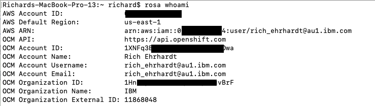
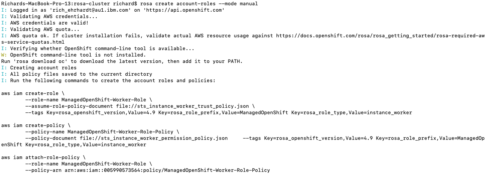

# Setup ROSA Cluster on AWS
This guide goes through how to deploy a custom Red Hat OpenShift on AWS (ROSA) cluster.
---
## Prerequisites
1. AWS Account
1. ROSA Enabled in AWS account
1. Red Hat Account
---
## Steps
1. Download and install the ROSA command line tool
1. Login at the comamnd line (this includes a link to download and create if necessary the access token)
1. Verify credentials and quota
    Verify credentials

        $ rosa whoami

    

    Verify quota

        $ rosa verify quota

    

1. Create account roles and configuration files

        $ rosa create account-roles --mode manual

    

1. Download and install the OpenShift command line tool if not already

        $ rosa download oc
    
    For Mac, untar the bundle. Copy oc to /usr/local/bin and create a symbolic link to kubectl.
    1. tar xvzf openshift-client-mac.tar.gz
    1. cp ./oc /usr/local/bin
    1. ln -s /usr/local/bin /usr/local/kubectl

1. Deploy a cluster
    
        $ rosa create cluster --interactive --sts

    This will ask a number of questions to customize the build. 

## References
Instructions - [https://console.redhat.com/openshift/create/rosa/welcome](https://console.redhat.com/openshift/create/rosa/welcome)
AWS Prerequisite Details - [https://docs.openshift.com/rosa/rosa_getting_started/rosa-aws-prereqs.html](https://docs.openshift.com/rosa/rosa_getting_started/rosa-aws-prereqs.html)