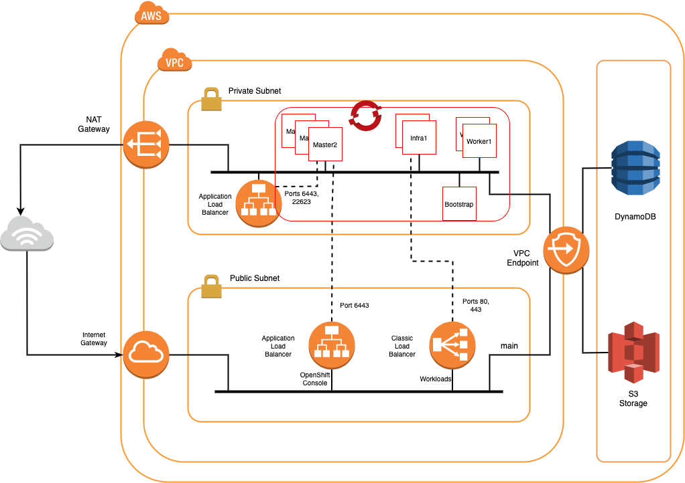
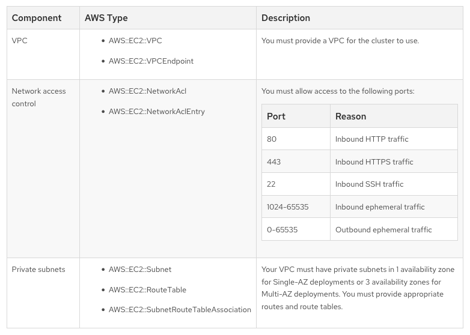

# Setup ROSA Cluster on AWS
This guide goes through how to deploy a custom Red Hat OpenShift on AWS (ROSA) cluster.
---
## Prerequisites
1. AWS Account
1. ROSA Enabled in AWS account
1. Red Hat Account
---
## Steps
1. Download and install the ROSA command line tool
1. Login at the comamnd line (this includes a link to download and create if necessary the access token)
1. Verify credentials and quota
    Verify credentials

        $ rosa whoami

    

    Verify quota

        $ rosa verify quota

    

1. Create account roles and configuration files

        $ rosa create account-roles --mode manual

    

1. Download and install the OpenShift command line tool if not already

        $ rosa download oc
    
    For Mac, untar the bundle. Copy oc to /usr/local/bin and create a symbolic link to kubectl.
    1. tar xvzf openshift-client-mac.tar.gz
    1. cp ./oc /usr/local/bin
    1. ln -s /usr/local/bin /usr/local/kubectl

1. Deploy a cluster
    
        $ rosa create cluster --interactive --sts

    This will ask a number of questions to customize the build. 

## Single-AZ cluster configuration

If a cluster is deployed in automatic mode it creates its own VPC and deploys into that VPC per the following architecture overview. It is split across 2 subnets. An internet gateway is configured for the VPC.
A NAT gateway is configured on the public subnet for IPv6 traffic.
A VPC endpoint is created for access to AWS services from either the private or public IP subnets.

## Multiple AZ cluster configuration

Creates its own VPC which can be later renamed and used for our purposes.

Command line to create cluster:

        rosa create cluster --cluster-name fs-test-03 --sts \
        --role-arn arn:aws:iam::<AWS_Account_id>:role/ManagedOpenShift-Installer-Role \
        --support-role-arn arn:aws:iam::<AWS_Account_id>:role/ManagedOpenShift-Support-Role \
        --controlplane-iam-role arn:aws:iam::<AWS_Account_id>:role/ManagedOpenShift-ControlPlane-Role \
        --worker-iam-role arn:aws:iam::<AWS_Account_id>:role/ManagedOpenShift-Worker-Role \
        --operator-roles-prefix fs-test-03-f4z4 \
        --multi-az \
        --region us-east-1 \
        --version 4.9.15 \
        --compute-nodes 3 \
        --machine-cidr 10.0.0.0/16 \
        --service-cidr 172.30.0.0/16 \
        --pod-cidr 10.128.0.0/14 \
        --host-prefix 23 \
        --etcd-encryption

The end result is a deployment with the following architecture.

## Privatelink cluster configuration

The default cluster creates its own VPC and associated network components which would need to be modified later for the customer requirements. An alternative is to provision a ROSA cluster into an existing VPC. This is done using the ROSA PrivateLink option during installation.

The prerequisites for deploying a ROSA PrivateLink cluster are documented on the Red Hat site [here](https://docs.openshift.com/rosa/rosa_getting_started/rosa-aws-privatelink-creating-cluster.html) and summarized in the following table from that site.

Since these prerequisites require no internet connectivity from the VPC, it does not fit the architecture being created for FS Cloud which includes internet access from the management and workload VPCs. As such, this option is not covered in this analysis.

## References
Instructions - [https://console.redhat.com/openshift/create/rosa/welcome](https://console.redhat.com/openshift/create/rosa/welcome)
AWS Prerequisite Details - [https://docs.openshift.com/rosa/rosa_getting_started/rosa-aws-prereqs.html](https://docs.openshift.com/rosa/rosa_getting_started/rosa-aws-prereqs.html)