# Access Options for AWS

This readme goes through options tested to access services deployed in AWS.

## Notes

- AWS Client VPN Endpoints support up to 66,500 connections with 3 subnet backends as in this architecture.

## Prerequisites

1. Create VPC and subnet
1. Create internet gateway
1. Attach gateway to VPC
1. Edit Network ACL for subnet to allow inbound traffic
1. Edit route table to ensure outbound traffic is directed to internet gateway

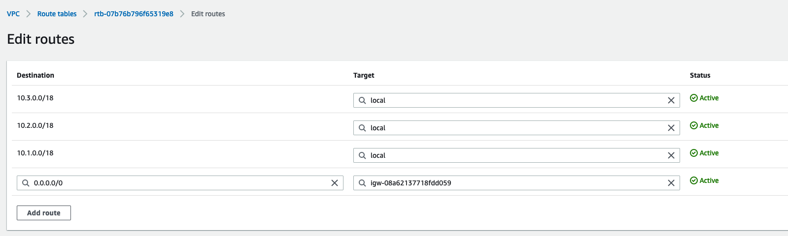

1. Create a key pair for access
1. Copy key to .ssh and make private (chmod 400 *.pem)

---

## Option 1. Public IP to instance (testing or dev only)

Scenario: Instance is deployed to subnet in VPC. 

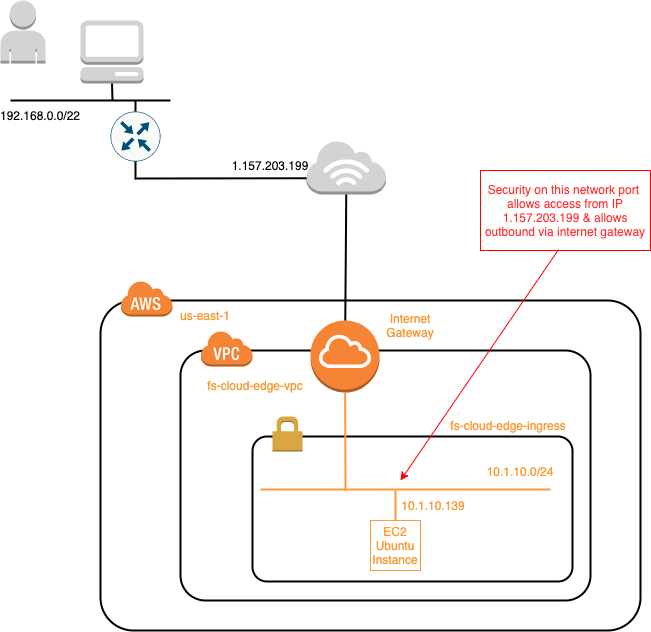

1. Launch EC2 instance

    1. Choose image (AMI)
    1. Choose size of instance
    1. Configure instance
        - choose VPC and subnet
        - select auto-assign public IP address

        

    1. Configure storage

    1. Configure security group

        - Ensure security group allows access from you IP address

    1. Review settings

    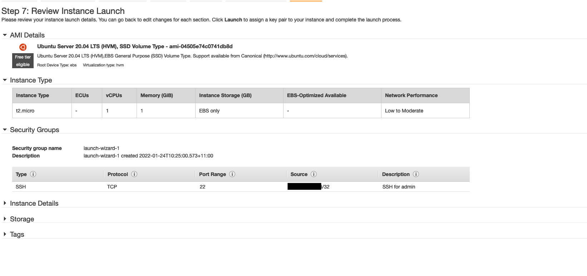

    1. Launch and choose key pair

    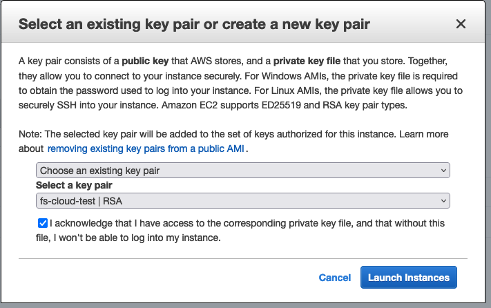

1. Access instance

    1. Check instance is running

    1. Get public IP address

    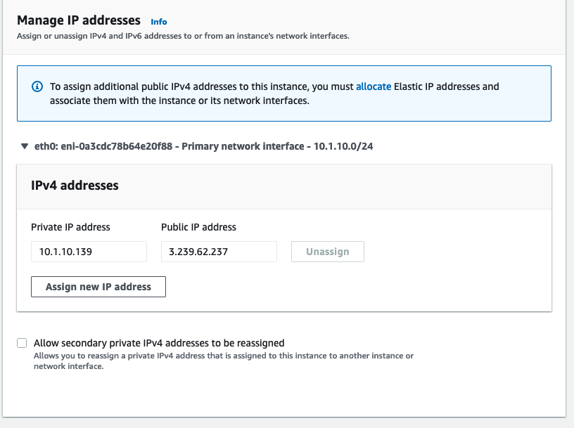

    1. ssh to instance

            $ ssh -i ~/.ssh/fs-cloud-test.pem ubuntu@3.239.62.237

    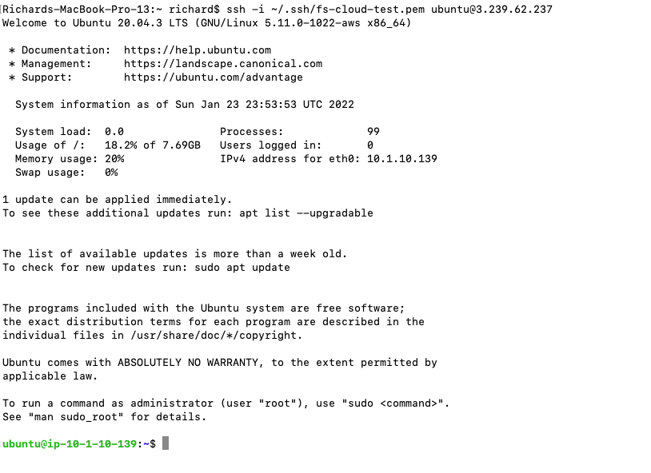

    1. Confirm instance network settings

    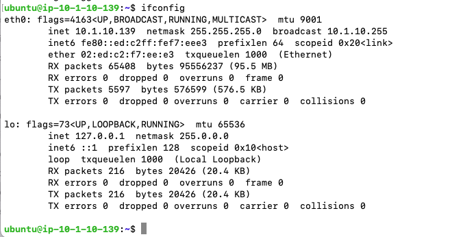

--- 

## Option 2. VPN connection (Preferred for production)

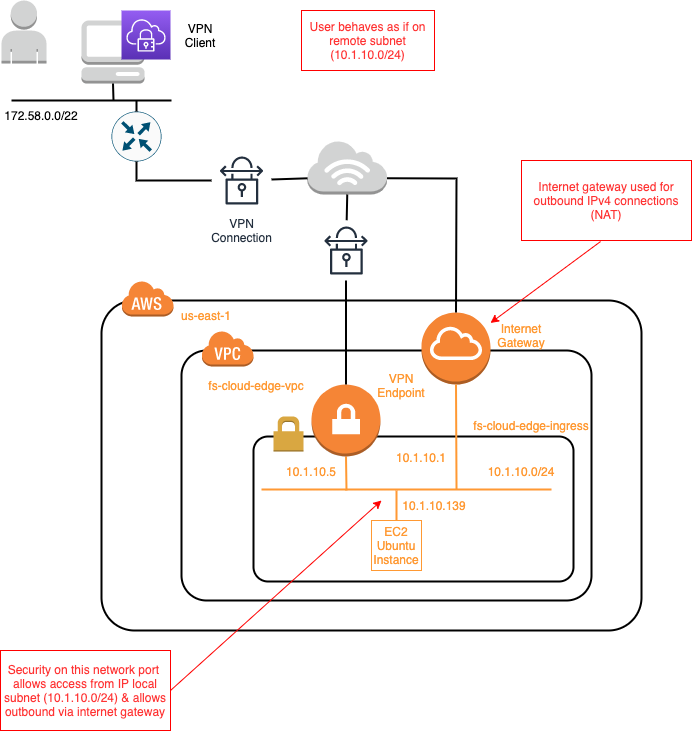

This method uses mutual authentication via RSA certificates. Other options include the use of SAML.

1. Create server certificate 

    1. [Create an RSA certificate](https://docs.aws.amazon.com/vpn/latest/clientvpn-admin/client-authentication.html) 

    1. Go to AWS Certificate Management (ACM) and confirm certificates are uploaded

    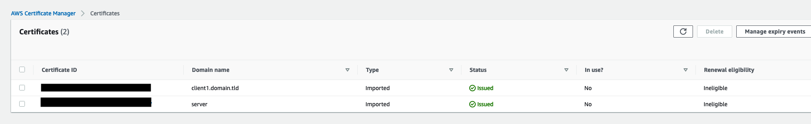

1. Create a VPN endpoint

Note that the client CIDR is the pool from which IP addresses are assigned for incoming clients. This is the IP address that it appears the client is attached to when viewed from the AWS VPC subnet. It needs to be between a /12 and /22 netmask and it should not overlap with the subnets in the VPC that it is going to connect to.

A split tunnel VPN should be enabled for most production scenarios to only direct traffic from the client that is destined for the AWS region over the VPN link. Doing so does require the route table to be created with all the relevant routes for the customer's AWS environment.

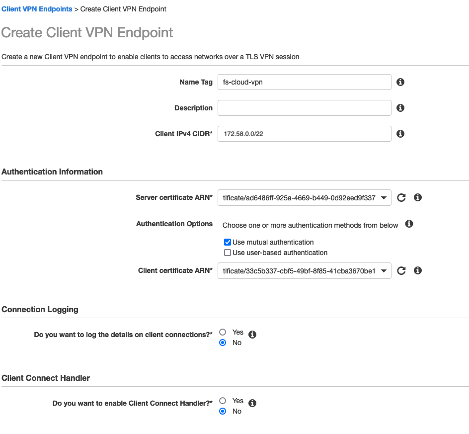

1. Associate VPN with subnet

1. Create authorization rule

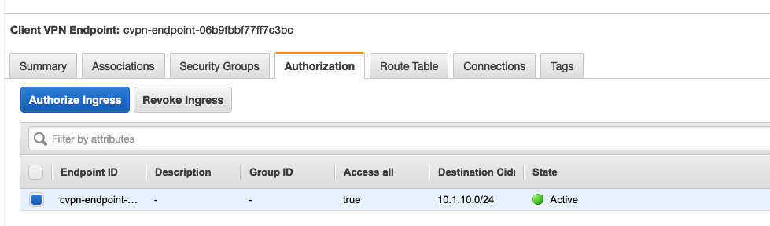

1. Download the OpenVPN configuration file

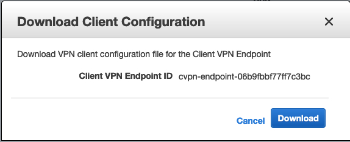

1. Edit the downloaded configuration file to add the client certificate and key previously created. client1.domain.tld.cert and client1.domain.tld.key.

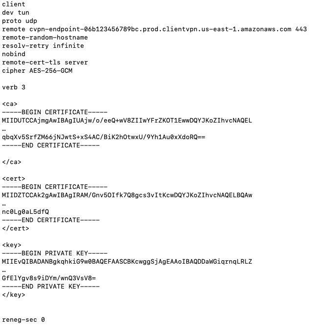

1. Setup the client (OpenVPN in this case)

For this example, a separate VM on the same network as the configuration Mac was utilized to setup an OpenVPN connection.

1. Access the EC2 instance

    - Ensure that the EC2 instances security group allows SSH connections from the local subnet (10.1.10.0/24 in this case)

    1. Connect the client

            $ sudo openvpn --config ~/Documents/vpn-config.ovpn

    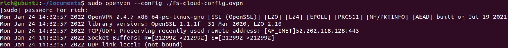
    

    1. SSH to the EC2 instance

            $ ssh -i ~/.ssh/fs-cloud-test.pem ubuntu@10.1.10.139

    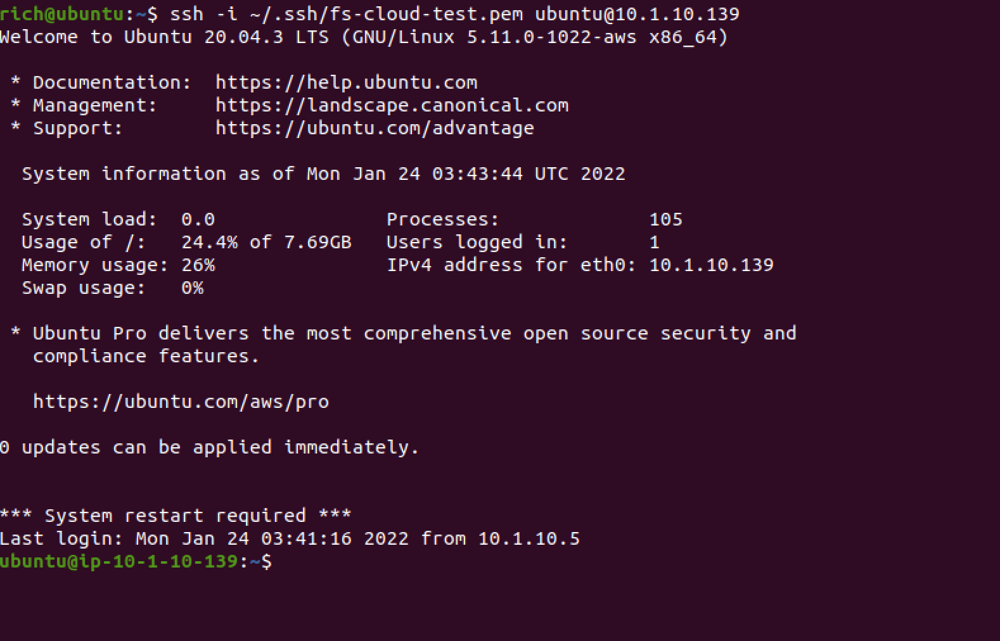

## References

[AWS Client VPN Endpoint Creation](https://docs.aws.amazon.com/vpn/latest/clientvpn-admin/cvpn-working-endpoints.html#cvpn-working-endpoint-create)

[Create RSA Certificate and upload to AWS Cert Mgr](https://docs.aws.amazon.com/vpn/latest/clientvpn-admin/client-authentication.html)

[Create VPN configuration file for clients](https://docs.aws.amazon.com/vpn/latest/clientvpn-admin/cvpn-working-endpoints.html#cvpn-working-endpoint-export)