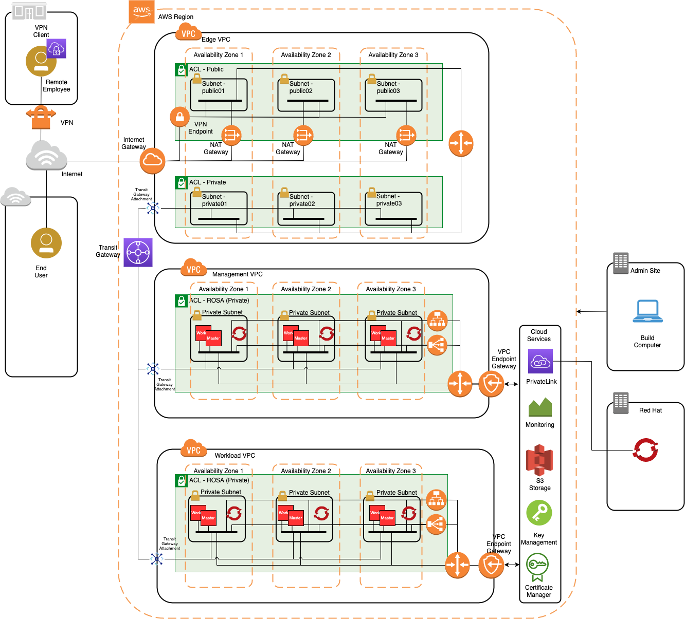

# Advanced OpenShift on AWS

Provisions managed OpenShift onto one or two VPC's with ingress and egress via a separate, VPC as defined [here](https://github.com/cloud-native-toolkit/automation-solutions/blob/aws-ref-arch-entry/architectures/awscloud.md) using Ansible automation.

## Software Dependencies

The module depends upon the following software components being installed on the build machine.

### Command-line Tools

- Ansible version 2.12.1 or higher (follow the guide [here](https://docs.ansible.com/ansible/latest/installation_guide/intro_installation.html))
- AWS CLI version 2.4.11 or higher (follow the guide [here](https://docs.aws.amazon.com/cli/latest/userguide/cli-chap-welcome.html))
- ROSA CLI version 1.1.7 or higher (follow the guide [here](https://docs.openshift.com/rosa/rosa_getting_started/rosa-installing-rosa.html))

### Module Dependences

This module makes use of the following Ansible modules.

- amazon.aws
- amazon.community.aws

### Subscription Dependencies

- AWS administrative access
- Red Hat OpenShift subscription access enabled on AWS

## Bill of Materials

This architecture consists of the following bill of materials:

| Item | Description |
|------------------ | ------------------------------------------------------------------------------- |
| Edge VPC | Provides for ingress and egress for the environment to and from the internet and/or Client VPN gateways or endpoints. |
| Management VPC | A private VPC into which an OpenShift cluster can be deployed for internal workloads. Ingress and egress is via the Edge VPC. |
| Workload VPC | A private VPC into which an OpenShift cluster can be deployed for client facing workloads. Ingress and egress is via the Edge VPC. |
| Edge Public Subnets | Provides network interface for devices such as VPN endpoints and NAT gateways. One subnet per availability zone. |
| Edge Private Subnets | Provide attachment for the transit gateway to the other clusters. One subnet per avialability zone. |
| Workload and Management Private Subnets | Provide attachment for OpenShift cluster nodes. One subnet per avialability zone. |
| Internet Gateway (IGW) | Provides the interface to the internet for the VPC. |
| NAT Gateway (NGW) | Provide masquerading of IP addresses on egress to the internet. One per availability zone. |
| Elastic IP | A public IP address allocated at the time of NAT Gateway provisioning. These are the public IP addresses of the NAT Gateways. |
| Route Tables | Route tables are applied to each subnet to route network traffic correctly |
| Security Groups | Provide firewall rules on each network port of the OpenShift cluster, including load balancers. One per device type (master, worker, load balancer). |
| Network ACL | Controls what network services are allowed to access the public, private and EC2 subnets. |
| Management and Workload ROSA Cluster | A managed OpenShift cluster that is deployed into the respective VPC. |
| Classic Load Balancer | Provides access to the deployed workloads on the OpenShift worker nodes. One per ROSA cluster deployed into the same VPC as the cluster.  |
| Network Load Balancer | Provides access to the OpenShift console and API on the OpenShift master nodes. One per ROSA cluster deployed into the same VPC as the cluster.  |
| Transit Gateway | Provides connectivity and routing between the VPCs and VPN gateways to client sites. |
| Transit Gateway VPC Attachments | Provide interface between the transit gateway and the VPCs.  One per VPC. |
| VPC Endpoint | Provides a gateway to AWS services such as S3 storage and PrivateLink. One per management and/or workload VPC. |
| PrivateLink | VPC gateway service that provides the abiltiy for Red Hat to manage the deployed cluster |
| Client VPN Endpoint | Optional add-on to provision a Client VPN Endpoint providing individual client access to the environment. |

## Limitations

- The automation only supports both management and workload VPCs.

## Example Usage

1. Ensure that a boto profile is created and AWS CLI is installed (if not follow guide [here](https://docs.aws.amazon.com/cli/latest/userguide/cli-chap-welcome.html))

        $ aws ec2 describe vpcs

Should return information on the current VPCs for your default region. <i>The default region needs to be the same as the one in which the advanced architecture is to be built.</i>

1. Ensure the aws configuration returns JSON format (this is required for some of the automation steps)

        $ cat ~/.aws/config

        [default]
        ...
        output = json

1. Clone this repository

    $ git clone https://github.com/cloud-native-toolkit/ibm-aws-reference-arch-ansible

1. Edit the advanced.yaml file for required configuration if different than the default below.

    ```
        vars:
                awsProfile: default
                awsRegion: ap-southeast-2
                availZones:    # Add availability zones as required (must all be part of the above region)
                - 'ap-southeast-2a'
                - 'ap-southeast-2b'
                - 'ap-southeast-2c'
                resourceGroup: 'recloud'  
                edge_name: 'edge'     # This forms the name of the VPC and other components
                wkld_name: 'wkld'     # This forms the name of the VPC and other components
                mgmt_name: 'mgmt'     # This forms the name of the VPC and other components
                edge_cidr: 10.0.0.0/16    # This is the CIDR for the edge VPC
                mgmt_cidr: 10.1.0.0/16    # This is the CIDR for the management VPC
                wkld_cidr: 10.2.0.0/16    # This is the CIDR for the workload VPC
                tierPrefix: 18       # This will be used to break the VPC CIDR up into tiers (public/private)
                subnetPrefix: 24     # This is the prefix for the individual subnets within each tier
                openshift_version: 4.9.23

1. Run the ansible playbook

        $ ansible-playbook ./advanced.yaml

1. Determine how you and your end users will access the OpenShift clusters. By default, they are only accessable from within the environment, but can be configured to have external access to the console and/or workloads. For example,

        Example 1. Customer site and end user access only.

        1. Edit the security groups associated with the network load balancer and the classic load balancer to allow traffic from the Edge VPC CIDR. 
        2. Add the management and workload VPC DNS's in DHCP of the edge VPC for devices connecting to the environment. 
        3. Include a Customer VPN Gateway connection and direct connect for VPN access from customer site.

        Example 2. End user accessability to workloads and internal only access to console

        1. Edit the security groups associated with the network load balancer and the classic load balancer to allow traffic from the Edge VPC CIDR. 
        2. Add the management and workload VPC DNS's in DHCP of the edge VPC for devices connecting to the environment for console access. 
        3. Include proxy servers / firewalls on the edge private subnets and a network load balancer with public IP on the public subnet that points to these.
        4. The proxy servers point to the management and/or workload classic load balancers and forward DNS requests.  
        5. Include a Customer VPN Gateway connection and direct connect for VPN access from customer site.


The environment setup by the Ansible automation above is shown below.


## Post installation tasks

Setup access to the private clusters

        Options include:
        - VPN gateway between onsite and AWS transit gateway.
        - Proxy servers and load balancer in Edge VPC for public access
        - Client VPN Endpoint
        - Remote desktop/jumpbox gateways

As an example, the following will configure an OpenVPN access server in AWS and allow a client configuration file to be downloaded.

1. Extend the Route53 DNS OpenShift zone from the management VPC into the edge VPC
1. Extend the Route53 DNS OpenShift zone from the workload VPC into the edge VPC
1. Follow the instructions [here](./cvpn-readme.md) to create the AWS OpenVPN Client VPN access server endpoint
1. Add the DNS servers to the downloaded configuration

        dhcp-option DNS 10.0.0.2 10.1.0.2

1. Configure your OpenVPN client with the downloaded configuration
1. Connect the VPN
1. Operate locally as if you are on the same network as the AWS VPC