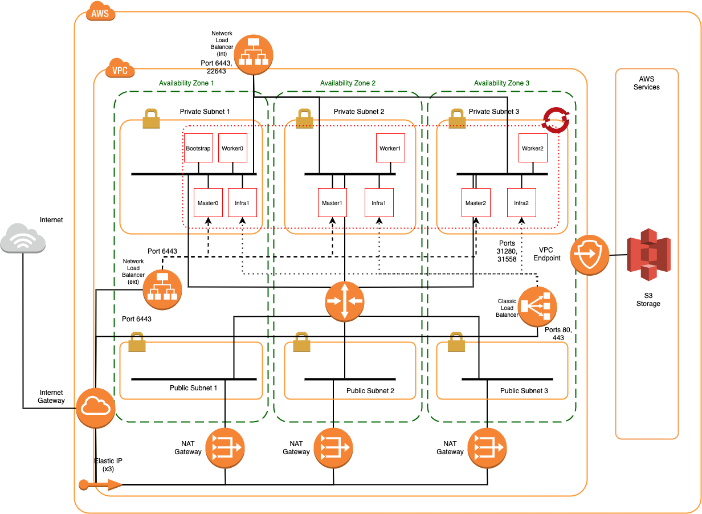

# Standard OpenShift on AWS

Provisions OpenShift onto a VPC per the reference architecture defined [here](https://github.com/cloud-native-toolkit/automation-solutions/blob/aws-ref-arch-entry/architectures/awscloud.md) using Ansible automation.

## Software Dependencies

The module depends upon the following software components being installed on the build machine.

### Command-line Tools

- Ansible version 2.12.1 or higher (follow the guide [here](https://docs.ansible.com/ansible/latest/installation_guide/intro_installation.html))
- AWS CLI version 2.4.11 or higher (follow the guide [here](https://docs.aws.amazon.com/cli/latest/userguide/cli-chap-welcome.html))
- ROSA CLI version 1.1.7 or higher (follow the guide [here](https://docs.openshift.com/rosa/rosa_getting_started/rosa-installing-rosa.html))

## Module Dependences

This module makes use of the following Ansible modules.

- amazon.aws
- amazon.community.aws

## Example usage

Edit the standard.yaml file for required configuration.

    vars:
        awsProfile: default         # The boto profile to be utilized
        awsRegion: ap-southeast-2   # Region into which to create the VPC and cluster
        availZones:                 # Add availability zones as required (must all be part of the above region)
        - 'ap-southeast-2a'
        resourceGroup: 'recloud'    # This is used to identify deployed resources
        vpcCIDR: 10.0.0.0/16        # The VPC subnet to be used (Subnets will be calculated from this)
        subnetPrefix: 24            # The prefix to be used for the required subnets
        openshift_version: 4.9.21   # The openshift version to deploy

Run the ansible playbook

    $ ansible-playbook ./standard.yaml

When complete, the automation will output the discovered and/or created resources into the inventory.yaml file in the root directory.

    # Cloud Inventory

    arch_type: 'Standard'
    inventory:
    Last_Update: Tue  1 Mar 2022 15:17:07 AEDT
        cidrs:
            private:
                cidr: 10.0.64.0/18
                subnets:
                - 10.0.64.0/24
            public:
                cidr: 10.0.0.0/18
                subnets:
                - 10.0.0.0/24
            vpc: 10.0.0.0/16
        igw:
            id: igw-0230b753b7ab66aff
            name: recloud-igw
        ngw:
        -   addresses:
            -   allocation_id: eipalloc-067052ba62e2440cb
                network_interface_id: eni-062bdc2b8a1c6791b
                private_ip: 10.0.0.55
                public_ip: 13.237.135.125
            id: nat-0c40128b48c9db994
            name: recloud-ngw-0
            state: available
            subnet_id: subnet-0e05785a356f56405
        rosa:
            console: https://console-openshift-console.apps.recloud-rosa.o4tv.p1.openshiftapps.com
            dns: recloud-rosa.o4tv.p1.openshiftapps.com
            id: 1qlj31tf2fhds34k473g43gcab345ag1
            name: recloud-rosa
            state: ready_
        rtbs:
        -   id: rtb-032fb1f0d60f1a70a
            name: recloud-private-rtb-0
            subnet_id: subnet-0c691a8b96b3103bf
        -   id: rtb-0c9a051efb381f840
            name: recloud-public-rtb-1
            subnet_id: subnet-0e05785a356f56405
        subnets:
        -   availability_zone: ap-southeast-2a
            cidr: 10.0.64.0/24
            id: subnet-0c691a8b96b3103bf
            name: recloud-private-0
        -   availability_zone: ap-southeast-2a
            cidr: 10.0.0.0/24
            id: subnet-0e05785a356f56405
            name: recloud-public-0
        vpc:
            cidr: 10.0.0.0/16
            id: vpc-000a01a878b6ab248
            name: recloud-vpc
            state: available

The above inventory can be shown in the following diagram.

